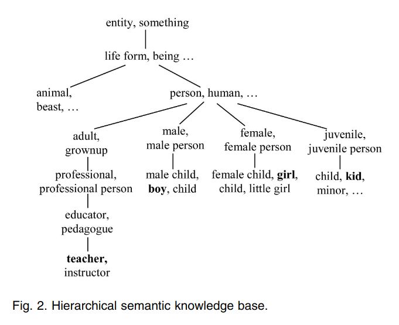

# About the Project

## What is Semantic Similarity
Semantic Textual Similarity (STS) is defined as the measure of “semantic equivalence”
between two blocks of text, phrases, sentences, or documents. Semantic similarity methods
usually give a ranking or percentage of similarity between texts.

The main objective Semantic Similarity is to measure the distance between the semantic
meanings of a pair of words, phrases, sentences, or documents.

## What is our project ( deliverables )
For our BTP project, we took inspiration from the below listed implementations which are
currently in use.

1. Customer Support : Companies can create a corpus of pre seen frequent  queries and with our engine they can look for queries which resemble the most similarity, and send an automated response saving lots of unnecessary work-force.
2. Medical : when a new case comes to a practitioner, he/she can look for similar cases in
the past and get the most closely resembling case and make better decisions.
3. Law : When a new case comes, law firms look over their database for similar cases in the
past and then strategies from those case studies. ( Currently used by some firms )
These examples are a reality but are still kept as an internal tool by organizations, as it brings
them a competitive edge.

We wish to present this technology in the hands of the general consumer with this platform
where individuals and organizations will be able to collect and classify text data, which will
accelerate their processes.

## How are we going to achive this.
The basic idea is to divide the entire process in 2 steps

1. Generate Embeddings for sentences
2. Compare those Embeddings

## Method's for generating Embedding
1. Using Semantic Nets and Corpus Statistics [1]
2. Sentence Embeddings using Siamese BERT-Networks [3]

## Method's Used for Comparing Embeddings
1. Cosine Based similarity

# Semantic Nets and Corpus Statistics
The proposed method derives text similarity from semanticand syntactic information contained in the compared texts. Unlike existing methods that use a fixed set of vocabulary, the proposed method dynamically forms a joint word set only using allthe distinct words in the pair of sentences.

for each sentence, a raw semantic vector is derived with the assistance of a lexical database. A word order vector isformed for each sentence, again using information from the lexical database.

Since each word in a sentence contributes differently to the meaning of the whole sentence, thesignificance of a word is weighted by using informationcontent derived from a corpus

By combining the rawsemantic vector with information content from the corpus, asemantic vector is obtained for each of the two sentences.

Semantic similarity is computed based on the two semantic vectors.
An word order similarity is calculated using the two order vectors.
Finally, the sentence similarity is derived bycombining semantic similarity and order similarity.

## Semantic Similarity between Words
Here we are utilizing semantic knowledge base to compare words. For this project we are using <b>WordNet</b>

In WordNet words are organized into synonym sets (synsets) in the knowledge base , with semantics and relation pointers to other synsets.

similarity between words is determined not only by path lengths but also by depth. We propose that the similaritys s(w1, w2) between words w1 and w2 as a function of path length and depth as follows:

- l is the shortest path length between w1 and w2,
- h is the depth of subsumer in the hierarchical semantic nets.
- f1 and f2 are transfer functions of path length and depth,respectively.
- $\alpha$ is experimental constants.
- $\beta$ > 0 is a smoothing factor and $\beta$ $\to$ $\infty$ then the depth of a word in the semantic nets is not considered.

## Semantic Similarity between Sentences

Given two sentences,T1andT2, a joint word set is formed:

T = T1 $\cup$ T2

Since the joint word set is purely derived from thecompared sentences, it is compact with no redundantinformation. The joint word set,T, can be viewed as the <b>semantic information</b> for the compared sentences.

The vector derived from the joint word set iscalled the <b>lexical semantic vector</b>, denoted by $\tilde{s}$

The value of an entry of the lexicalsemantic vector,
$\tilde{si}$ (i=1,2,...) , is determined by thesemantic similarity of the corresponding word to a word inthe sentence. Take T1 as an example:

Case 1. If wi appears in the sentence, si set to 1
Case 2. Else, a semantic similarity score is computed between wi and each word in thesentence T1, using above method. let call it x, then <b>si = ( x > $\epsilon$ ) ? x : 0</b>

Now that we have the lexical semantic vector, the semanticsimilarity between two sentences is defined as the cosinecoefficient between the two vectors:

## Word Order Similarity between Sentences
Let us consider a pair of sentences,T1andT2, that containexactly the same words in the same order with theexception of two words from T1 which occur in the reverse order in T2. For example:

- T1: A quick brown dog jumps over the lazy fox.
- T2: A quick brown fox jumps over the lazy dog.

For the example pair of sentencesT1andT2, the jointword set is:

- T : { A,quick,brown,dog,jumps,over,the,lazy,fox }

assign a unique index number for each word inT1andT2. The index number is simply the order number inwhich the word appears in the sentence.

indexes : { A : 0 , quick : 1 , brown : 2 , dog : 3 , jumps : 4 , over : 5 , the : 6 , lazy : 7 , fox : 8 }

word order vectors for T1 and T2 are r1 and r2, respectively.

- r1 : { 1,2,3,4,5,6,7,8,9 }
- r2 : { 1,2,3,9,5,6,7,8,4 }

The measure for measuring the wordorder similarity of two sentences is:

## Overall Sentence Similarity

Both semantic and syntactic information (in terms ofword order) play a role in conveying the meaning ofsentences. Thus, the overall sentence similarity is defined asa combination of semantic similarity and word ordersimilarity:

where $\delta$ <1 decides the relative contributions of semanticand word order information to the overall similarity computation.

# Sentence Embeddings using Siamese BERT-Networks

# Cosine Similarity
Cosine similarity is a measure of similarity between two non-zero vectors of an inner product space. It is defined to be equal to the cosine of the angle between them, which is also the same as the inner product of the same vectors normalized to both have length 1.

# Datasets Used

### Sick DataSet
Marelli et al.compiled the SICK dataset for sentence level semantic similarity/relatedness in
2014 composed of 10,000 sentence pairs obtained from the ImageFlickr 8 and MSR-Video
descriptions dataset. The sentence pairs were derived from image descriptions by various
annotators. 750 random sentence pairs from the two datasets were selected,followed by three
steps to obtain the final SICK dataset: sentence normalisation, sentence expansion and sentence
pairing.
### STS DataSet
In order to encourage research in the field of semantic similarity, semantic textual similarity
tasks called SemEval have been conducted from 2012. The organizers of the SemEval tasks
collected sentences from a wide variety of sources and compiled them to form a benchmark data
set against which the performance of the models submitted by the participants in the task was
measured

# Dev Progress

- Front End
    - [x]  Home Page
    - [x]  Authentication
        - [x]  Single User
        - [ ]  Organization
    - [ ]  Comparison page ( For both Org and Individuals )
        - [ ]  Multiple sentence A and Multiple Sentence B ( Comparison )
            - [ ]  Inserting One by One
            - [ ]  Inserting with file upload in specific format
    - [ ]  Company registration page
        - [ ]  Upload file
    - [ ]  API Help Page
----
- Back End
    - [x]  DB
        - [x]  DB Models
        - [x]  DB Layer
    - [ ]  REST API layer
        - [ ]  For Interaction with front-end
        - [x]  For Interaction with other world
    - [ ]  Comparison Engine Integration
----
- Comparison Engine
    - [x]  Corpus Based Algorithm - Embedding generator
    - [x]  Sent-Sim Algorithm - Embedding generator
    - [x]  Comparison Methods
        - [x]  One to One
        - [x]  One to Many
        - [x]  Many to Many

# References

1. Y. Li, D. McLean, Z. A. Bandar, J. D. O'Shea and K. Crockett, "Sentence similarity based on semantic nets and corpus statistics," in IEEE Transactions on Knowledge and Data Engineering, vol. 18, no. 8, pp. 1138-1150, Aug. 2006, doi: 10.1109/TKDE.2006.130.

2. Miller, G.A., 1995. WordNet: a lexical database for English. Communications of the ACM, 38(11), pp.39-41.

3. Reimers, N. and Gurevych, I., 2019. Sentence-bert: Sentence embeddings using siamese bert-networks. arXiv preprint arXiv:1908.10084.

4. Devlin, J., Chang, M.W., Lee, K. and Toutanova, K., 2018. Bert: Pre-training of deep bidirectional transformers for language understanding. arXiv preprint arXiv:1810.04805.

